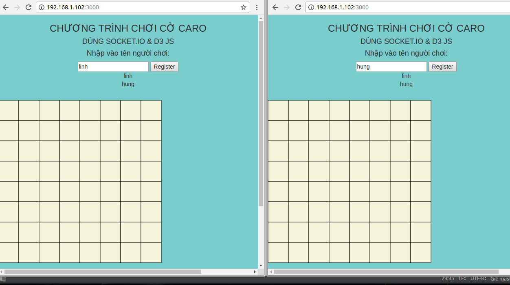
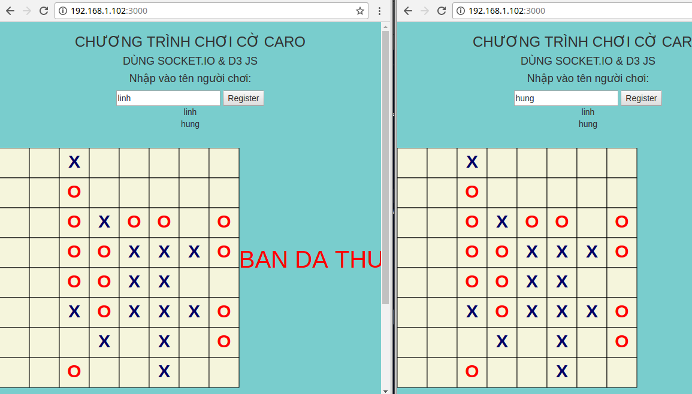
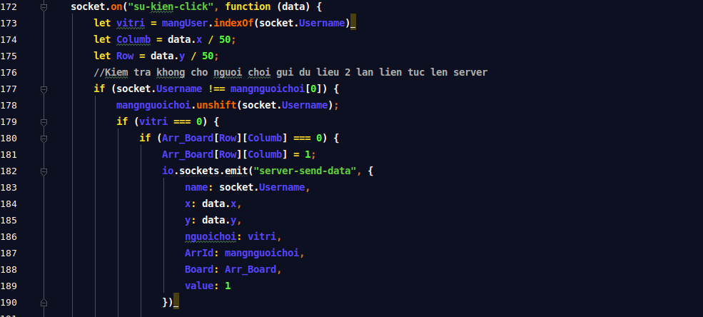

# caro_chess
Chương trình chơi cờ caro với 2 người chơi (dùng D3 js, socket.io)

#Giới thiệu nguồn gốc trò chơi cờ Caro
* Ban đầu loại cờ này được chơi bằng các quân cờ vây (quân cờ màu trắng và đen) trên một bàn cờ vây (19x19). Quân đen đi trước và người chơi lần lượt đặt một quân cờ của họ trên giao điểm còn trống. 
* Người thắng là người đầu tiên có được một chuỗi liên tục gồm 5 quân hàng ngang, hoặc dọc, hoặc chéo. Tuy nhiên, vì một khi đã đặt xuống, các quân cờ không thể di chuyển hoặc bỏ ra khỏi bàn, do đó loại cờ này có thể chơi bằng giấy bút. Ở Việt Nam, cờ này thường chơi trên giấy tập học sinh (đã có sẵn các ô ca-rô), dùng bút đánh dấu hình tròn (O) và chữ X để đại diện cho 2 quân cờ.
* Một ván cờ caro Việt Nam với các quân cờ dạng X,O.


# Các công nghệ sử dụng để xây dựng chương trình
## Socket.io
* Socket io là một thư viện Javascript dùng để phát triển các ứng dụng thời gian thực. Thư viện Socket.IO được phát triển để dùng cho cả client và server(chạy Node.js) 
* Đầu tiên thư việc Socket.IO có thể được cài đặt trên server (Node.js) sử dụng chương trình quản lý package Node hay NPM. Sau khi cài đặt bạn có thể khởi động Socket.IO như sau: 
 ```javascript 
        var socket = require('socket.io');
```
* Với việc Socket.IO được sử dụng trên server thì sau đó server sẽ cung cấp một địa chỉ URL để client (trình duyệt ) có thể tải thư viện Socket.IO này về từ server và nhúng vào trang như sau:
```javascript 
        <script src="/socket.io/socket.io.js"></script>
```
## D3.js 
* Là một thư viện rất nổi tiếng trong thế giới Web Visualization, D3.js có thể sử dụng để trực quan hóa dữ liệu, vẽ các biểu đồ, đồ thị trực quan, bản đồ, ... thậm chí làm được cả Game. D3 vừa ra mắt 4.0, với các chức năng mới như modular, composed of small libraries. 
* Download trực tiếp trên trang chủ D3js.com
* Dùng link CDN nhúng vào trang html
# Hướng dẫn cách chạy chương trình
1. clone chương trình bằng lệnh sau: https://github.com/manhlinhhumg1985/caro_chess
2. Vào thư mục vừa tải về chạy file server.js bằng lệnh: node server.js
3. Mở 2 trình duyệt chrome nhập vào địa chỉ: 192.168.1.102:3000 (nếu máy khác thì dùng lệnh ifconfig để lấy địa chỉ IP máy rồi thay vào dòng 29 bên trang trangchu.ejs) sẽ hiện lên giao diện như sau:



4. Tiến hành gõ tên đăng nhập để tạo người chơi
5. Sau khi tiến hành chơi người chơi thứ 2 đạt 5 ô X thì sẽ báo cho người chơi 1 bị thua cuộc và sẽ không cho cả 2 bên click thêm vào bàn cờ nữa kết quả như sau:



# Giải thích chương trình 
## Cách dữ liệu trong chương trình gửi từ client lên server và server trả về cho người chơi như sau:
* Khi một trong 2 người chơi click lên 1 ô vuông trên bàn cờ thì phía người chơi phát 1 sự kiện gửi lên server và dữ liệu kèm theo đó là một object(x: x,
y: y) với x, y là tọa độ của ô vuông trên bàn cờ bằng đoạn code như sau:


* Phía server sẽ lắng nghe sự kiện phát ra từ người chơi 1 với dữ liệu nhận được là tọa độ (x,y) của người chơi 1 và đồng thời từ server sau khi lắng nghe sự kiện phát ra từ người chơi 1 thì sẽ add thêm tọa độ (x,y) vừa gửi từ người chơi 1 vào mảng chứa các nước đi trên server và kiểm tra thắng thua sử dụng mảng 2 chiều này, đồng thời sẽ phát lại cho 2 người chơi tọa độ (x,y) của người chơi 1  

```javascript 
        socket.on("su-kien-click", function (data) {
        let vitri = mangUser.indexOf(socket.Username)
        let Columb = data.x / 50;
        let Row = data.y / 50;
        //Kiem tra khong cho nguoi choi gui du lieu 2 lan lien tuc len server
        if (socket.Username !== mangnguoichoi[0]) {
            mangnguoichoi.unshift(socket.Username);
            if (vitri === 0) {
                if (Arr_Board[Row][Columb] === 0) {
                    Arr_Board[Row][Columb] = 1;
                    io.sockets.emit("server-send-data", {
                        name: socket.Username,
                        x: data.x,
                        y: data.y,
                        nguoichoi: vitri,
                        ArrId: mangnguoichoi,
                        Board: Arr_Board,
                        value: 1
                    })
          }
```
* Tương tự cũng như vậy cho các nước đi của người chơi thứ 2.
## Logic của toàn bộ chương trình như sau:
### Phía Client
1. Vì chương trình có sử dụng D3 js, bootstrap, socket.IO do đó có thể dùng link cdn hay dùng thư mục tải về từ trang chủ. Trong chương trình sử dụng link cdn.
2. Phần logic nằm trong thẻ script
* Đầu tiên tạo 1 kết nối lên server bằng code sau:

```javascript 
        var socket = io("192.168.1.102:3000")
        trong đó: 192.168.1.102 là địa chỉ IP của máy
```

* Tiến hành nhập tên người chơi vào ô input và phát sự kiện "socket.emit gửi lên server" mục đích nhập tên người chơi để tạo mảng kiểm tra sau này.

```javascript 
        $(document).ready(function () {
        //nguoi choi emit ten dang nhap len server
            $("#btnRegister").click(function () {
                socket.emit("client-send-name", $("#txtUsername").val())
            })
         })
``` 

* Sau khi gửi lên server thì server trả về  tên người chơi cho cả 2 người chơi bằng lệnh sau:

```javascript 
        socket.on("server-send-danhsach-user", function (data) {
            $("#boxContent").html("");
            data.forEach(function (i) {
                $("#boxContent").append("<div class='user'>" + i + "</div>")
             })
        })
```
trong đó: socket.on là lắng nghe sự kiện gửi từ server với name phải trùng tên với name ở trên server
* Tiếp theo tiến hành vẽ các ô vuông tượng trưng cho bàn cờ bằng code sau:

```javascript 
        const div = d3.select("body").append("div").attr("id", "content").style("text-align","center");
         const svg = div.append("svg").attr("width", 800).attr("height", 600);
         for (let i = 0; i < 8; i++) {
        for (let j = 0; j < 8; j++) {
            // draw each chess field
            const box = svg.append("rect")
                .attr("x", i * 50)
                .attr("y", j * 50)
                .attr("width", 50)
                .attr("height", 50)
                .attr("id", "b" + i + j)
                .style("stroke","black")
                .on("click", function () {
                    let selected = d3.select(this);
                    socket.emit("su-kien-click", {x: selected.attr('x'), y: selected.attr('y')})

                });
            if ((i + j) % 2 === 0) {
                box.attr("fill", "beige");
            } else {
                box.attr("fill", "beige");
            }
        }
        }
```

- ở mỗi ô vuông ta sẽ gán cho 1 sự kiện click với mục đích khi người chơi click vào 1 ô trên bàn cờ thì tiến hành lấy tọa độ (x,y) của ô vuông vừa click đồng thời sẽ phát 1 sự kiện gửi tọa độ này lên server

* Sau khi người chơi gửi tọa độ (x,y) khi người chơi click vào ô vuông trên bàn cờ thì server lắng nghe sự kiện đó và trả về các giá trị sau:
- người chơi các thuộc tính của người chơi là 1 đối tượng trong đó có các thuộc tính thông qua biến data {tọa độ x, tọa độ y, giá trị của người chơi}. Ở đây giá trị người có thể là 1 hoặc 0 nếu là 1 thì đánh "X" nếu là 0 thì đánh"0".
- nếu bị thua tức là thỏa điều kiện thua sau khi kiểm tra ma trận nước đi trên server và sẽ gửi thông điệp không cho người chơi click tiếp vào bàn cờ, code thực hiện như sau:
- code này thể hiện khi ai sẽ là người đánh "X" hay "0"

```javascript 
       
        socket.on("server-send-data", function (data) {
        console.log("gia tri ma client nhan tu server:")
        console.log("mang nguoi choi :" + data.ArrId)
        console.log("Id:" + data.name);
        console.log("nguoi cho thu:", data.nguoichoi)
        console.log("Ma tran cac nuoc di:",data.Board)
        console.log("Gia tri cua nguoi choi:"+ data.value)
        console.log("x_client:" + data.x);
        console.log("y_client:" + data.y);
        let matrix = data.Board;
        let Cur_Row = parseInt(data.x);
        let Cur_Col = parseInt(data.y);
        let Value = parseInt(data.value);
        const tick = svg
            .append("text")
            .attr("x", parseInt(data.x))
            .attr("y", parseInt(data.y))
            .attr("text-anchor", "middle")
            .attr("dx", 50 / 2)
            .attr("dy", 50 / 2 + 8)
            .text(function () {
                if (data.nguoichoi === 1) {
                    return "X"
                }
                else if (data.nguoichoi === 0) {
                    return "O"
                }
            })
            .style("font-weight", "bold")
            .style("font-size", "30px")
            .style("fill", function () {
                if (data.nguoichoi === 1) {
                    return "000066"
                }
                else if (data.nguoichoi === 0) {
                    return "FF0000"
                }
            })

        })
```

- code thể hiện khi người thua thì sẽ in lên mà hình đối thủ string="BAN DA BI THUA" với data được gửi từ server

```javascript 
         socket.on("phat-su-kien-thang-thua",function (data) {
        const lost = svg
            .append("text")
            .attr("x",400)
            .attr("y",200)
            .text(data)
            .style("fill","red")
            .style("font-size", "40px")
        })
```
- code thể hiện không cho cả 2 người chơi click vào màn hình khi 1 trong 2 người chơi bị thua cuộc

```javascript 
         socket.on("khong-cho-doi-thu-click-khi-thua",function () {
            $('#content').css('pointer-events', 'none');
        })
```

### Phía Server

1. Trong chương trình có dùng express để kết nối tới server nên ta cấu hình cho server như sau:

```javascript 
         const express = require("express")
        let app = express();
        //vi trang web minh la co rat nhieu file javascript hay css
        // ma cu moi lan co request cua khach hang gui len ma lai tao ra thi khong duoc
        //cho nen phia server minh se tao 1 thu muc la public
        //va tat ca cac file de trong public khach hang truy cap dc het
        app.use(express.static("./public"));//-> tất cả các requet gui len thi khach hang di vao  public ma tim
        app.set("view engine", "ejs")
        app.set("/views", "./views")//thu muc chua "trangchu"
        let server = require("http").Server(app);
        //khai bao socket
        var io = require("socket.io")(server)
        server.listen(3000);
        //lang nghe co nguoi ket noi len server
```
2. Tạo mảng 1 chiều chứa danh sách người chơi và ma trận 2 chiều (8x8)chứa các nước đi của mỗi người chơi được gửi lên từ client
- code khởi tạo mảng và ma trận như sau:

```javascript 
         let mangUser = [];
        let mangnguoichoi = [];
        //Tao ra mang ban co trong do cac cell co gia tri ban dau la 0
        //muc dich tao ra ma tran ban co nay de xet thang thua cho nguoi choi
        //dung method cua Array
        Array.matrix = function (n, init) {
            let mat = [];
            for (let i = 0; i < n; i++) {
                a = [];
                for (let j = 0; j < n; j++) {
                    a[j] = init;
                }
                mat[i] = a;
            }
            return mat;
        }
        let Arr_Board = Array.matrix(8, 0)
```
- Sau khi khởi tạo xong thì trên server có 1 ma trận kích thước 8x8 với giá trị ban đầu là 0

```javascript 
            [[ 0, 0, 0, 0, 0, 0, 0, 0 ],
             [ 0, 0, 0, 0, 0, 0, 0, 0 ],
             [ 0, 0, 0, 0, 0, 0, 0, 0 ],
             [ 0, 0, 0, 0, 0, 0, 0, 0 ],
             [ 0, 0, 0, 0, 0, 0, 0, 0 ],
             [ 0, 0, 0, 0, 0, 0, 0, 0 ],
             [ 0, 0, 0, 0, 0, 0, 0, 0 ],
             [ 0, 0, 0, 0, 0, 0, 0, 0 ]]
```
- Tiếp theo tiến hành xây dựng các phương thức kiểm tra thắng thua dùng ma trận trên với các giá trị là 1 và 2(1,2 chỉ là giá trị của người chơi do mình quy ước)
- Ví dụ nếu trên ma trận có 5 ô thẳng hàng ngang với giá trị của các ô liền nhau đều bằng 1 hoặc 2 thì sẽ giành chiến thắng. 
- Để kiểm tra được có thỏa mãn hay không thì logic cần xử lý ở đây là: ví dụ khi ta click vào 1 ô thì client gửi giá trị tọa độ ô đó lên server và server sẽ kiểm tra trong ma trận xem ô này đã được đánh hay chưa nếu đánh rồi sẽ có giá trị là 1 hay 2 cón nếu chưa đánh sẽ có giá trị 0. 
- Phương thức Horizontal sẽ tiến hành kiểm tra theo hàng ngang xem có 5 ô liền nhau có cùng giá trị hay không bằng cách cho duyệt từ vị trí ô hiện tại sang phía bên trái và bên phải của nó nếu thỏa mãn điều kiện >= 5 thì sẽ trả về true còn không chỉ cần gặp 1 ô có giá trị khác thì ta sẽ dùng câu lệnh "break " để thoát khỏi vòng lặp luôn mà không làm gì cả. 
- code thực hiện như sau:


```javascript 
         let Horizontal = (Mat, Cur_row, Cur_col, Value) => {
        //di sang ben trai
        let count_left = 0;
        let count_right = 0;
        //Di sang phia ben trai so voi vi tri hien tai
        for (let i = Cur_col; i >= 0; i--) {
            if (Mat[Cur_row][i] === Value) {
                count_left++;
            }
            else {
                break;
            }
        }
         //Di sang phia ben phai so voi vi tri hien tai
        for (let j = Cur_col + 1; j < 8; j++) {
            if (Mat[Cur_row][j] === Value) {
                count_right++;
            }
            else {
                break;
            }
        }
        if (count_right + count_left >= 5) {
            return 1;
        }
        }
        trong đó: Mat là ma trận được lưu ở server
                  Cur_row là vị trí hiện tại của ô được click tương ứng với hàng của ô đó trên ma trận
                  Cur_col là vị trí hiện tại của ô được click tương ứng với cột của ô đó trên ma trận
                  Value giá trị của người chơi có thể là 1 hay 2
```
- 4 phương thức kiểm tra theo các phương khác nhau cũng xử lý gần như tương tự
3. Server nhận kết nối từ phía người chơi bằng code sau:


- server sẽ hứng sự kiện "client-send-name" từ phía client gửi lên và sẽ push vào mảng mangUser và gán cho biến socket một thuộc tính mới là Username = data đồng thời gửi lại mảng mangUser về cho cả 2 người chơi thể hiện bằng code sau:


```javascript 
         //lang nghe su kien tu client gui len
        socket.on("client-send-name", function (data) {
            if (mangUser.length > 2) {
                socket.emit("send-dki-that-bai")
            }
            else {
                mangUser.push(data);
                socket.Username = data;
                io.sockets.emit("server-send-danhsach-user", mangUser)
            }
        })
```
- server hứng sự kiện "su-kien-click" từ phía client sự kiện này được gửi lên mỗi khi người chơi click vào 1 vuông trên bàn cờ với data là (x,y)
- code để hứng sự kiện click từ người chơi gửi lên như sau:



- trong đó dòng 172: biến vitri sẽ tìm xem khi mà người chơi click từ phía client thì dữ liệu gửi lên có chứa thuộc tính socket.Username đã được tạo ra trước đó mục đích dòng biến này được tạo ra để xác định xem người mà click từ phía client đó người thứ mấy trong mangUser.
- dòng 174 và 175 khai sẽ là biến thể hiện cho vị trí của ô click tương ứng với dòng nào và cột nào trên ma trận.
- dòng 177 sẽ kiểm tra người chơi có trong mảng người chơi hay không ở đây mangnguoichoi chứa luân phiên các username của người chơi nhập vào mảng này động và tăng dần, 
- dòng 178 sẽ đưa vào các phần tử được đưa vào đầu mảng bằng lệnh unshift() vì chỉ cần so sánh với phần tử đầu tiên xem có trùng nhau không
- dòng 179 sẽ kiểm tra xem đó là người chơi 1 hay 2
- nếu là người chơi 1 thì sẽ add giá trị 1 vào hàng và cột tương ứng (dòng 181)
- đồng thời sẽ gửi về cho cả 2 người chơi dữ liệu bằng sự kiện "server-send-data" với sự kiện này sẽ sang phía client để biết có tác dụng như thế nào(dòng 181 -> dòng 190)
- Tiến hành kiểm tra theo các phương ngang, thẳng dứng, đường chéo chính, đường chéo phụ xem có thỏa mãn điều kiện 5 ô liên tiếp có cùng giá trị hay không (với cả 2 người chơi)
code như sau: 

```javascript 
        if (Horizontal(Arr_Board, Row, Columb, 1)) {
                        string = "BAN DA THUA CUOC";
                        socket.broadcast.emit("khong-cho-doi-thu-click-khi-thua");
                        socket.broadcast.emit("phat-su-kien-thang-thua", string);
                    }
                    if (Vertically(Arr_Board, Row, Columb, 1)) {
                        string = "BAN DA THUA CUOC";
                        socket.broadcast.emit("khong-cho-doi-thu-click-khi-thua");
                        socket.broadcast.emit("phat-su-kien-thang-thua", string);
                    }
                    if (Diagonal(Arr_Board, Row, Columb, 1)) {
                        string = "BAN DA THUA CUOC";
                        socket.broadcast.emit("khong-cho-doi-thu-click-khi-thua");
                        socket.broadcast.emit("phat-su-kien-thang-thua", string);
                    }
                    if (Diagonal_main(Arr_Board, Row, Columb, 1)) {
                        string = "BAN DA THUA CUOC";
                        socket.broadcast.emit("khong-cho-doi-thu-click-khi-thua");
                        socket.broadcast.emit("phat-su-kien-thang-thua", string);
                    }

                }
```
# Như vậy trên đây logic từng bước để thực hiện chương trình 

